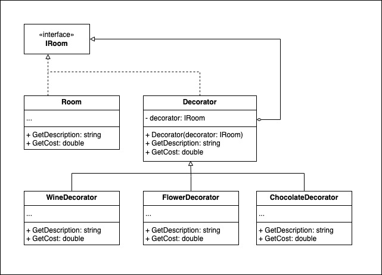

# Asignacion: patrones de diseño 3 para el grupo 4
Asignación patrones de diseño 3 para el grupo 4 del diplomado de arquitectura de software de la Universidad de la Sabana

### Integrantes:
- CC 1.037600.004 Santiago Monsalve Calderón
- Ricardo Delgado
- Alejandro Farfán Montenegro
- Oscar Quiroz Ortega
- Daniel Urueña Arbeláez

### Ejercicio 6
- **Realizado por**: Santiago Monsalve Calderón
- **Reto:** Decoración de habitaciones en un hotel
- **Patrón usado:** decorador
- **Argumento:** El patrón decorador permite añadir elementos de manera flexible y dinámica respetando el principio Open/Close y Single Responsability
- **Diagrama**\
  
